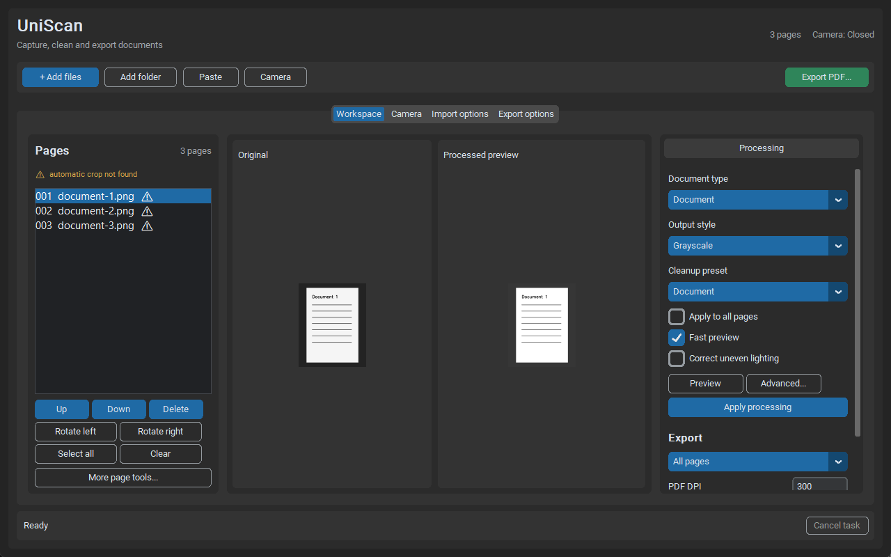

# UniScan

UniScan is a local, Windows-first document preparation tool. It captures or imports pages, finds
and rectifies the document, corrects geometry, cleans the image, lets you review the result, and
exports processed images or a plain raster PDF.

```text
camera / images / PDF
        -> page boundary and perspective
        -> orientation
        -> deskew
        -> local dewarp
        -> cleanup and page layout
        -> review and Apply
        -> PDF / images
```

The repository keeps its historical `img_2_pdf` directory name. The maintained package, command,
and product name are `uniscan` and UniScan.

UniScan is deliberately a pre-OCR tool. It does **not** recognize text, create searchable PDFs,
preserve PDF vectors or bookmarks, export Office files, or send documents to a cloud service.
It also cannot reconstruct detail that glare or clipping already destroyed in the source.



## Quick start

### Run from this source checkout on Windows

Python 3.11 or newer is required. The launcher creates `.venv`, installs the package when
necessary, and opens the GUI:

```powershell
.\run_uniscan.cmd
```

The first installation may need internet access to obtain Python packages. Once the environment is
installed, ordinary OpenCV processing is local.

To pass CLI arguments through the same launcher:

```powershell
.\run_uniscan.cmd doctor
.\run_uniscan.cmd convert --input scans --output out\document.pdf
```

For a manual development setup:

```powershell
py -3.11 -m venv .venv
.\.venv\Scripts\python.exe -m pip install -e ".[dev]"
.\.venv\Scripts\python.exe -m uniscan
```

`python camscan_hybrid_tool.py` remains a compatibility launcher. It calls the package entry
point and does not contain a separate scanner implementation.

### Run the portable Windows build

A portable build contains `uniscan.exe` and does not require development Python:

```powershell
.\uniscan.exe doctor
.\uniscan.exe
.\uniscan.exe convert --input scans --output document.pdf
```

Keep the extracted directory together. Build and release details are in
[the Windows release guide](docs/windows_release.md).

## What the GUI can do

The desktop application keeps one persistent Workspace. Camera capture opens from the top action
bar, and export settings appear only when requested.

You can acquire pages from:

- a camera, including delayed multi-shot capture;
- an image or PDF file picker;
- a non-recursive folder import;
- drag and drop;
- clipboard images or clipboard file paths.

The Workspace supports page selection, reorder and deletion, replacement or camera retake, manual
four-corner perspective correction with a live corrected pane, automatic crop, 90-degree
orientation, deskew, an adjustable spread-split line, automatic wave removal, and an editable wave
curve. All processing editors replace the Workspace content instead of opening another window.
Corner, split-line, and wave-point drags show a circular magnifier centered on the cursor and
sampled from the full-resolution source.
Perspective point changes are saved automatically when moving to another page or choosing Done;
Reset and Auto Detect replace the current point positions without an extra Apply Current step.
Wave points can be added, removed, and moved in both axes on three independent Top, Middle, and
Bottom curves. Each curve can follow a different contrasting page feature; correction is smoothly
interpolated between their vertical regions. Clicking any curve or point selects it directly. Along
each curve, shape-preserving cubic interpolation uses the neighboring 3-4 points, including cubic
continuation to the image edges when no endpoint was placed there.
Processing controls cover document type,
grayscale/B&W output, contrast, brightness, denoise, thresholding, illumination correction,
binarization, despeckle, A4/Letter layout, margins, alignment, and lighting analysis.

When exactly one processed page is selected, Processing loads that page's committed stage recipe.
Orientation, deskew, dewarp, lighting, cleanup and layout can then be changed independently: the
edited stage is overridden while the other accepted automatic or manual settings are preserved.
Orientation supports conservative auto, off and explicit 90/180/270-degree choices. Deskew supports
auto estimators, off and an exact manual angle. Four-corner perspective, split and three-curve wave
geometry continue to use their visual editors.

### Preview, Apply, and export

These controls intentionally have different meanings:

1. **Preview** shows what the current controls would do. It does not change exported pixels.
2. **Fast preview** uses a smaller display proxy for the general processing pane. Geometry editors
   always calculate perspective and wave results from the full-resolution source and resize only
   the finished image for display.
3. **Apply preview to pages** runs the canonical pipeline on the full-resolution stored page and
   commits that result. On a single committed page it starts from that page's recipe, so changing
   one stage does not silently reset the rest. The wave diagnostic is explicitly labelled as a
   preview until then.
4. **Export** reads each page's latest committed pixels. It never silently replays whatever global
   controls happen to be visible later.

A newly imported page already has valid stored source/rectified pixels, so it can be exported
without additional processing. After Apply, UniScan stores the exact recipe, diagnostics, and a
SHA-256 pixel fingerprint of the committed current image. If a page changes while a background
Apply job is running, the stale result is rejected. If a multi-page Apply fails while committing,
earlier pages in that Apply are rolled back.

A4 or Letter layout has physical meaning only together with its Apply DPI. The GUI refuses to
export such a committed page at a different PDF DPI; set the intended DPI and Apply again.

PDF import is streamed page by page and staged on disk. Full-resolution Apply also runs in a
cancellable worker and stages results on disk before committing them. Some individual Page tools
and the final local PageStore publication are still synchronous, so exceptionally large pages can
briefly pause the interface.

### Session recovery

The GUI autosaves unfinished work under `%LOCALAPPDATA%\UniScan` by default. Set
`UNISCAN_STATE_DIR` before launch to use another state directory.

Only one GUI process may write a given autosave state at a time. A second instance exits with an
actionable error instead of sharing and corrupting the same session. On restart, UniScan restores
the disk-backed page order and metadata, repairs disposable previews, and ignores stale processing
metadata whose fingerprint no longer matches the actual committed image. Recoverable corrupt pages
are skipped with warnings rather than allowing the next autosave to delete their source assets.

The current GUI provides crash recovery, not a general project-file/Open/Save As workflow. Use an
explicit output directory and export completed work before deleting the state directory.

## Inputs and outputs

### Supported input

| Input | Behavior |
|---|---|
| JPG/JPEG, PNG, WEBP, BMP | One page per file |
| TIF/TIFF | Every frame is imported as a page |
| PDF | Every page is rasterized with `pypdfium2` and streamed |
| Folder | Supported files in that folder only, in natural order (`page2` before `page10`) |
| Camera/clipboard | GUI only |

EXIF orientation is applied. Alpha is composited on white. Higher-bit-depth samples are scaled into
the 8-bit processing pipeline instead of being saturated by a naive cast.

Every raster, TIFF frame, restored page, cache image, and rendered PDF page is checked before
decoding or allocation. The default fail-closed limit is **150,000,000 pixels per page**. The CLI
can lower or raise the input limit with `--max-input-pixels`. A PDF page that is too large at the
requested input DPI fails; UniScan does not silently reduce its DPI and change its physical size.

A4/Letter layout has a separate fixed **150,000,000-pixel output allocation limit**. Reduce output
DPI if a standard-page layout exceeds it.

### Produced output

- a required plain merged PDF in `convert`;
- optional processed page images: PNG, JPG/JPEG, WEBP, TIF/TIFF;
- a JSON run report for `convert`, defaulting to `<output>.report.json`.

The PDF contains raster pages. It is not searchable and does not retain text, links, forms,
bookmarks, layers, or vector objects from an input PDF. Headless `convert` uses lossless embedding
by default. Use `--pdf-jpeg-quality 1..100` to opt into JPEG compression for smaller photographic
PDFs; `--pdf-jpeg-quality 0` is the lossless default.

## Headless conversion

A minimal conversion:

```powershell
.\.venv\Scripts\python.exe -m uniscan convert `
  --input scans page-cover.png source.pdf `
  --output out\document.pdf
```

This safe default does not opt into boundary detection, cleanup, or geometric transforms. Input
PDF pages are still rasterized because UniScan's output is a raster PDF.

A more complete document job:

```powershell
.\.venv\Scripts\python.exe -m uniscan convert `
  --input scans `
  --output out\document.pdf `
  --images-dir out\pages `
  --report out\document.report.json `
  --mode document `
  --detect `
  --orientation auto `
  --deskew hybrid `
  --dewarp auto `
  --page-layout a4 `
  --page-margin-mm 10 `
  --output-pdf-dpi 300 `
  --pdf-jpeg-quality 80 `
  --lighting-diagnostics
```

Important defaults and controls:

| Area | Options and actual default |
|---|---|
| Cleanup | `--mode {none,document,grayscale,whiteboard,photo,b/w}`; default `none` |
| Detection | disabled; `--detect` enables it, and `--backend auto` then means local OpenCV `cv_hybrid` |
| Detector choices | `auto`, `office_lens_onnx`, `cv_hybrid`, `opencv_quad`, `opencv_hough`, `opencv_minrect` |
| Detection failure | keep the unchanged page by default; `--strict-detect` fails the whole atomic job |
| Geometry | `--orientation none`, `--deskew none`, and `--dewarp none` by default |
| Book spreads | `--two-page` splits only when a confident central gutter is detected |
| Layout | `--page-layout none`; A4/Letter use 10 mm centered margins by default |
| Cleanup detail | binarization and despeckle default to `none`; local window defaults to 31 |
| Images | disabled unless `--images-dir` is set; format defaults to PNG |
| PDF compression | lossless by default; `--pdf-jpeg-quality 1..100` opts into JPEG embedding |
| Stage cache | disabled unless `--stage-cache-dir` is set; enabled limit defaults to 512 MiB |

Use `--detect` to opt into boundary detection. `--no-detect` remains a compatibility alias for
the safe default. `--strict-detect` requires `--detect`.

### The two PDF DPI roles

PDF DPI is intentionally split:

- `--input-pdf-dpi` controls rasterization of input PDF pages;
- `--output-pdf-dpi` assigns physical size during page layout and PDF export;
- legacy `--pdf-dpi` supplies the default for both roles when an explicit override is absent.

All three default to an effective 300 DPI. Use the same input and output DPI to preserve the
physical scale of an unlaid-out input PDF. Changing only output DPI changes the physical page size.
For `--page-layout a4|letter`, output DPI controls pixel dimensions while the requested paper size
remains physical A4 or Letter.

### Geometry and cleanup stages

Boundary detection/perspective and spread splitting happen first. When a forced 90/180/270
orientation is configured with `--two-page`, that known rotation is applied before the spread
decision. GUI Apply and headless conversion then share
`PageProcessingRequest -> process_document_page() -> PageProcessingResult` for:

1. conservative non-OCR 0/90/270 orientation (180 is explicit-only);
2. small-angle deskew: `hybrid`, `hough`, or `min_area`;
3. local dewarp;
4. cleanup/postprocess;
5. content-box detection and optional A4/Letter layout.

`--orientation auto` uses conservative non-OCR layout evidence. For a camera series whose physical
rotation is known, use `--orientation 90`, `180`, or `270` to force that clockwise correction and
avoid inherently ambiguous 180-degree text-direction guesses.

`document` preserves source colour while applying document contrast and denoise settings;
`grayscale` is the explicit monochrome document profile.

Spread mode is conservative: the oriented source frame must itself have spread-like landscape
geometry, a wide detector crop alone is not sufficient, and an uncertain image is kept as one page
instead of being cut at its midpoint. The report records `spreadDetected`, `spreadConfidence`, and
`spreadReason` for each produced page. A small boundary crop that changes a portrait source into a
wide strip is rejected as destructive and recorded as a detection fallback; a substantial
landscape crop can still represent a real spread inside a portrait PDF canvas. When boundary
detection leaves that canvas intact, a large horizontal content region is checked separately.
After a confident split, each half receives its own perspective pass. A second-pass quadrilateral
must cover at least 60% of the half, span at least 80% of its width, reach safe top/bottom bands,
and have page-like proportions, so table columns and partial crops are rejected.

`--dewarp textline` uses the built-in text-line geometry estimator and needs no optional model
runtime. `--dewarp docscanner_l` runs the exact SHA-pinned external DocScanner-L ONNX graph when
`UNISCAN_DOCSCANNER_MODEL` points to it. `--dewarp auto` is a conservative policy when explicitly
selected: it tries text-line dewarp, measures whether geometry improved, and rejects harmful
candidates. UVDoc is not considered unless `--auto-dewarp-uvdoc` is also present. The balanced
real-camera gate retains bundled UVDoc as the automatic neural default; DocScanner-L remains an
explicit alternative. On the aspect-corrected full DIR300 benchmark, DvD led quality while
DocScanner-L was the strongest exact ONNX production candidate. Lighting diagnostics
measure shadows, possible glare, clipping, and unevenness without claiming to reconstruct missing
detail.

See [the geometry guide](docs/document_geometry.md), the
[balanced real-camera benchmark](docs/geometry_real_camera_benchmark_2026-08-17.md), and
[the stage-order audit](docs/geometry_stage_order_audit_2026-08-15.md) for the measured limitations
of the current order and the plan that addresses them.

## JSON report

The current run report uses `schemaVersion: 3`. It records:

- canonical output/report/image paths and discovered inputs;
- `inputPdfDpi`, `outputPdfDpi`, legacy `pdfDpi` (the output DPI), `pdfJpegQuality`, and
  `maxInputPixels`;
- every effective detector, geometry, cleanup, layout, and cache setting;
- page count, detected/fallback count, and per-page fallback reason;
- orientation, deskew, dewarp, content-box, cleanup, and lighting evidence;
- per-page and per-stage durations;
- stage-cache hits and aggregate cache statistics.

Reports include local paths and may therefore contain sensitive filenames. Treat them like the
documents they describe.

## Atomic output and concurrent writers

Direct PDF/image exports are staged and atomically replaced. A batch conversion stages its PDF,
optional image directory, and report as one recoverable transaction:

- cancellation or failure preserves the previously published output set;
- a durable journal rolls back an interrupted prepared transaction on the next matching run;
- an ownership manifest replaces only image files previously written by UniScan and preserves
  unrelated neighboring files;
- direct and batch UniScan processes use the same canonical target locks;
- link-like output paths and symlink, junction, reparse-point, or multiply-linked lock files are
  rejected before mutation.

These locks coordinate **UniScan writers only**. Explorer, an editor, a sync client, or an arbitrary
script does not honor them. Do not modify the same final files concurrently from another program.

## Stage cache

The processing-stage cache is lossless, atomic, bounded, and dependency-aware. Keys include source
pixels, options, upstream stage identity, and the processing algorithm version. Corrupt or oversized
entries become misses and are deleted. Changing a late cleanup option can reuse earlier valid
geometry stages, while changing geometry invalidates downstream results.

The GUI keeps a persistent cache under its state directory and exposes a clear action in Advanced.
The CLI cache is opt-in:

```powershell
.\.venv\Scripts\python.exe -m uniscan convert `
  --input scans --output out\document.pdf `
  --stage-cache-dir out\stage-cache --stage-cache-max-mb 512
```

UVDoc- or DocScanner-backed and downstream results are not reused persistently when UniScan cannot
prove a stable model identity.

## Optional Office Lens ONNX backend

Office Lens support is bring-your-own-model (BYOM). UniScan does not distribute Microsoft Lens
weights, and installing the optional runtime does not grant rights to model files.

Install the runtime and point UniScan to a lawfully obtained model directory:

```powershell
.\.venv\Scripts\python.exe -m pip install -e ".[office-lens]"
$env:UNISCAN_OFFICE_LENS_MODEL_DIR = "D:\licensed-models\office-lens"
```

The quad model `mnv2_ep42_wb_quant.ort` is required. The classifier
`triclass_doc_classifier.ort` is required only by the standalone Office Lens `--mode auto`
cleanup flow.

```text
explicit document/whiteboard/photo mode:
image -> quad model -> quad refinement -> warp -> selected cleanup

auto mode:
image -> classifier -> quad model -> quad refinement -> warp -> resolved cleanup
```

In the production converter, `--backend office_lens_onnx` uses the quad model for boundary
detection when `--detect` is enabled, while `--mode` selects UniScan cleanup independently. The
default `--backend auto` does not select Office Lens; it selects `cv_hybrid`.

`uniscan doctor` reports a missing optional model as disabled. A configured but unreadable quad
model is a blocking failure. A missing or broken classifier is non-blocking because explicit modes
remain usable.

More details and the direct one-image runner are in
[the Office Lens adapter guide](docs/office_lens_onnx.md).

The current tree and build artifacts contain no Office Lens weights. Older `.ort` objects remain
in Git history until the repository owner separately approves and performs a destructive history
rewrite. A normal commit or push does not purge those objects.

## Optional PaddleOCR UVDoc

UVDoc is a post-crop dewarp backend, not a boundary detector.

- `--dewarp paddleocr_uvdoc` explicitly selects it.
- `--dewarp auto --auto-dewarp-uvdoc` permits it only as a fallback.
- `--uvdoc-cache` selects its cache location.

A compatible PaddleOCR runtime is not installed by the standard package or portable build, and
there is currently no `uvdoc` project extra. UniScan neither bundles UVDoc weights nor implements
its own downloader. PaddleOCR may initialize, download, or populate its model cache on first
explicit use, so do not enable UVDoc when a strictly offline first run is required.

## Diagnostics and troubleshooting

Run the core checks:

```powershell
.\.venv\Scripts\python.exe -m uniscan doctor
.\.venv\Scripts\python.exe -m uniscan doctor --gui-runtime
.\.venv\Scripts\python.exe -m uniscan doctor --camera --camera-index 0
.\.venv\Scripts\python.exe -m uniscan doctor --json
```

Common failures:

- **Another UniScan process is using the autosave session** - close the other GUI or launch with a
  different `UNISCAN_STATE_DIR`.
- **Input exceeds the safe pixel limit** - lower `--input-pdf-dpi`, crop/resample the source, or
  deliberately adjust `--max-input-pixels` if the machine can safely handle it.
- **A4/Letter DPI mismatch in the GUI** - set the target PDF DPI and apply the preview again.
- **No boundary found** - inspect the unchanged fallback page, try a specific OpenCV backend or
  manual corners, or use `--strict-detect` when fallback is unacceptable.
- **Office Lens disabled** - configure the external quad model and install `onnxruntime`; add the
  classifier only for standalone auto mode.
- **Recovered cache/session warning** - UniScan rejected stale or corrupt derived data. The source
  page remains the authority.

## Development and verification

Install development and release tools:

```powershell
.\.venv\Scripts\python.exe -m pip install -e ".[dev,release]"
```

The required automated checks are:

```powershell
.\.venv\Scripts\python.exe -m pip check
.\.venv\Scripts\python.exe -m ruff check .
.\.venv\Scripts\python.exe -m ruff format --check .
.\.venv\Scripts\python.exe -m pytest --cov=uniscan --cov-report=term-missing --cov-fail-under=60 -q
.\.venv\Scripts\python.exe -m coverage report --omit=src/uniscan/ui/app.py --fail-under=80
```

Quality baselines:

```powershell
.\.venv\Scripts\python.exe -m uniscan benchmark-quality `
  --input benchmarks\corpus_v1 `
  --output quality-report.json `
  --baseline benchmarks\corpus_v1\baseline.json

.\.venv\Scripts\python.exe -m uniscan benchmark-geometry `
  --input benchmarks\geometry_v1 `
  --output geometry-report.json `
  --baseline benchmarks\geometry_v1\baseline.json
```

Quality-first model tournament (candidate licences are recorded but never scored):

```powershell
.\.venv\Scripts\python.exe -m uniscan benchmark-models `
  --input benchmarks\geometry-real-v1 `
  --candidate uvdoc=out\uvdoc `
  --candidate docscanner-l=out\docscanner-l `
  --candidate dvd=out\dvd `
  --output out\geometry-tournament.json
```

See [the tournament manifest and candidate contract](docs/model_tournament.md) and the
[current model shortlist](docs/model_evaluation.md).
The tournament guide also documents the fail-closed `docunet-corrected`/`dir300` importer,
known `64_1`/`64_2` correction, versioned OCR subsets and hash-bound official LD/AAD results.

Build the Windows x64 portable ZIP, SHA-256 file, frozen-runtime smoke tests, and dependency-license
inventory:

```powershell
.\scripts\build_windows.ps1
```

Tagged CI creates a draft prerelease only. Public distribution still requires clean-machine and
real-camera smoke evidence, archive/license review, checksum verification, Authenticode signing,
and a deliberate manual publish. See the [release checklist](docs/release_checklist.md) and
[manual smoke checklist](docs/manual_smoke_checklist.md).

## Architecture map

| Module | Responsibility |
|---|---|
| `src/uniscan/io` | bounded raster/PDF loading and camera service |
| `src/uniscan/core/pipeline.py` | boundary detection, perspective, spread split |
| `src/uniscan/core/processing.py` | canonical post-detection stage controller |
| `src/uniscan/core` | orientation, deskew, dewarp, cleanup, content box, layout |
| `src/uniscan/session` | ordered page model, manifest schema and recovery |
| `src/uniscan/storage` | disk-backed PageStore and persistent stage cache |
| `src/uniscan/export` | atomic PDF/image publication and output locks |
| `src/uniscan/tools/batch_pipeline.py` | supported headless production pipeline and report |
| `src/uniscan/diagnostics.py` | runtime, optional-model, GUI and camera checks |
| `src/uniscan/ui` | desktop acquisition, review, Apply and export workflow |
| `src/uniscan/office_lens` | optional BYOM ONNX adapter |

## Known limitations and project status

- OCR, searchable PDFs, cloud processing, annotations, Office/OneNote export, and auto-capture are
  out of scope or not implemented.
- Folder import is non-recursive.
- Standard page layout currently supports A4 and Letter.
- Glare diagnostics cannot restore clipped source detail.
- The GUI is Windows-first; some large synchronous Page tools can briefly pause it.
- Autosave is recoverable state, not a user-managed project file format.
- A clean-machine portable test and real-camera test remain manual release gates.
- Public Windows artifacts require signing.
- Historical Office Lens model objects are not purged by this work.

The current engineering roadmap is in [docs/roadmap.md](docs/roadmap.md). The
[current capability summary](docs/mvp_status_and_lens_comparison.md),
[stage-cache design](docs/stage_cache.md), and
[manual smoke checklist](docs/manual_smoke_checklist.md) provide narrower reference material.
Older plan documents are retained as implementation history, not as the source of current behavior.
