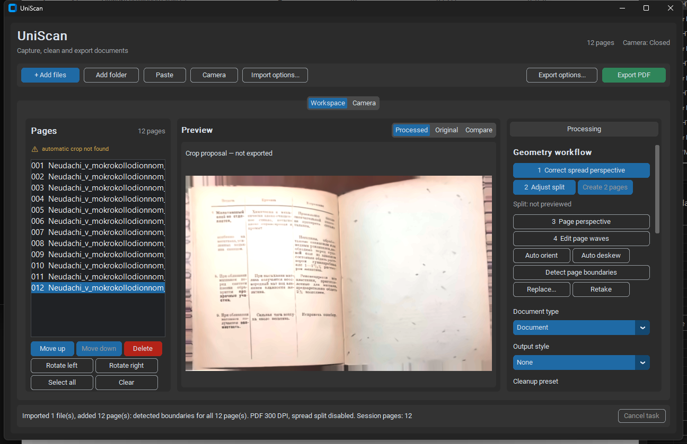
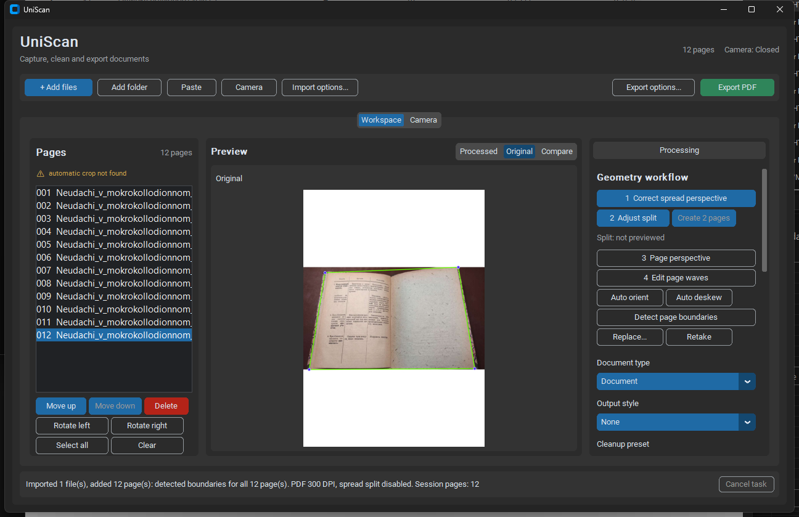
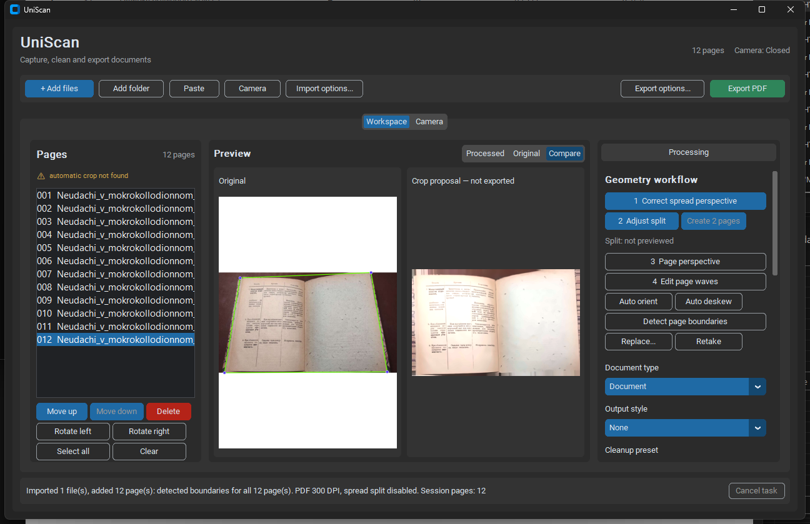
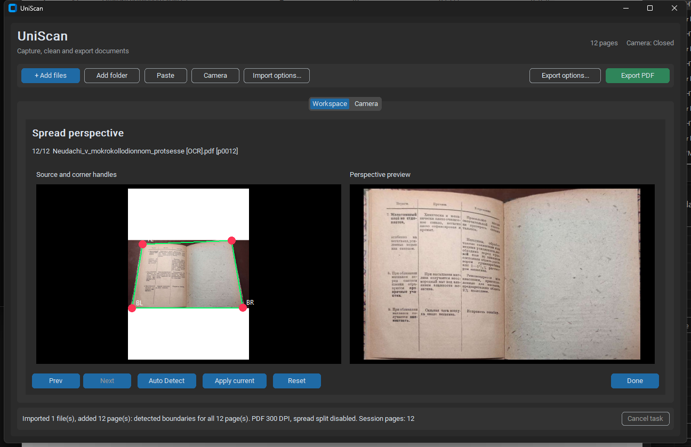
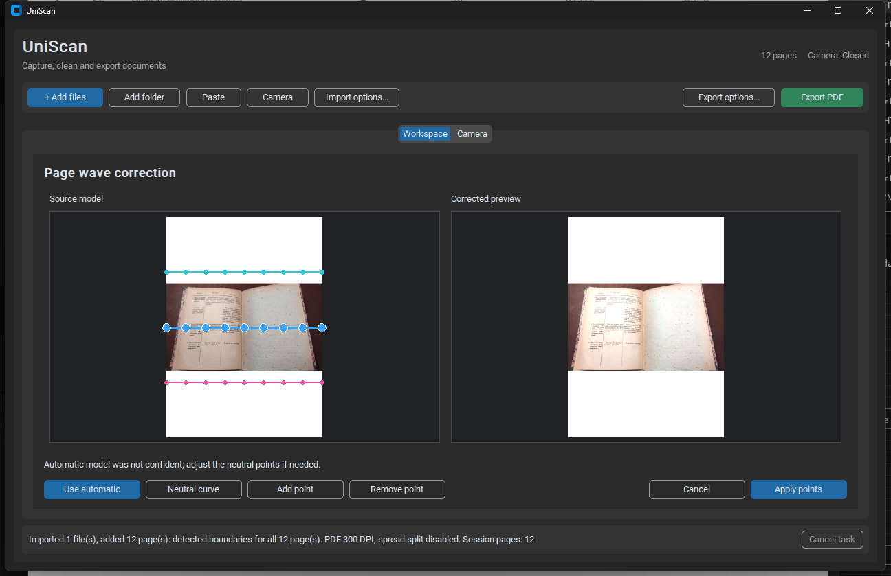
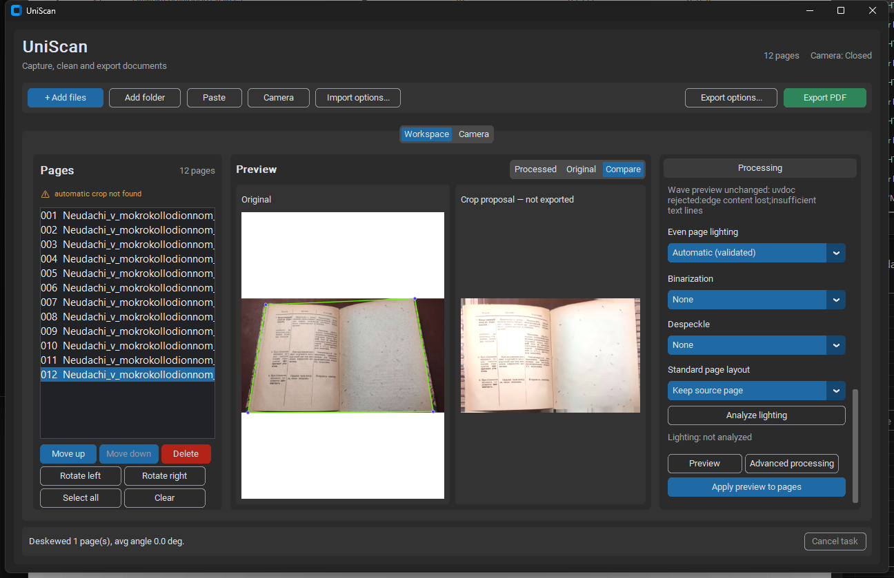
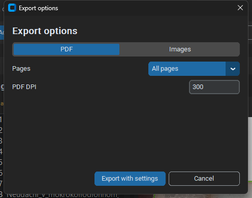

# UniScan — аудит взаимодействия и pipeline

Дата: 2026-08-21  
Проверенный HEAD: `f6ab111` (`codex/geometry-benchmark-fixes`, `origin/geometry-uvdoc`)  
Метод: запуск фактического GUI, импорт repository sample PDF, проверка состояний Workspace / Original / Compare / Perspective / Waves / Advanced / Export и чтение обработчиков. Исходный код не изменялся.

## Как читать отчёт

- **Факт** — подтверждён GUI, скриншотом или кодом.
- **Гипотеза** — предлагаемая модель/решение; требует прототипирования и пользовательской проверки.
- Критичность: **P0** — риск потери/неверного результата; **P1** — серьёзно мешает основной задаче; **P2** — заметное трение/неясность; **P3** — локальная полировка.

## Краткий вывод

Backend уже поддерживает гораздо более зрелый продуктовый контракт, чем показывает интерфейс: источник сохраняется, crop остаётся proposal до Apply, expensive previews отменяются, batch Apply/Export используют snapshots, stage cache инвалидирует downstream, recipe переигрывается после geometry edit. Однако пользователь видит не pipeline, а длинную колонку настроек и несколько отдельных inline-редакторов. Поэтому безопасная non-destructive модель выглядит как набор несвязанных действий, а экспортируемое/предпросматриваемое состояние трудно отличить.

Главный структурный приоритет — сделать stage state первоклассным объектом UI: `mode + status + reason + revision + committed/candidate`. После этого существующие технические гарантии можно показать, а не переписывать.

## Что уже сделано хорошо

1. **Immutable source / proposal.** При стандартном импорте boundary detection работает в proposal-only режиме: [app.py:3471](../src/uniscan/ui/app.py#L3471). Preview явно подписывает crop proposal как не экспортируемый: [app.py:3823](../src/uniscan/ui/app.py#L3823).
2. **Cancellable preview.** Изменение настройки отменяет предыдущий debounce/worker и игнорирует устаревшее поколение: [app.py:3930](../src/uniscan/ui/app.py#L3930), [app.py:3944](../src/uniscan/ui/app.py#L3944).
3. **Batch jobs.** Import, Apply и Export используют общий background job с progress/cancel: [app.py:1855](../src/uniscan/ui/app.py#L1855), [app.py:6467](../src/uniscan/ui/app.py#L6467), [app.py:6599](../src/uniscan/ui/app.py#L6599).
4. **Transactional intent.** Apply snapshot-ит source и previous current до обработки: [app.py:6174](../src/uniscan/ui/app.py#L6174). Export замораживает committed generation: [app.py:6502](../src/uniscan/ui/app.py#L6502).
5. **Durable downstream replay.** После upstream geometry edit сохраняется previous recipe и переигрываются downstream policies: [app.py:4985](../src/uniscan/ui/app.py#L4985).
6. **Multi-page basics.** Есть extended selection, drag reorder, context menu и часть keyboard navigation: [app.py:1063](../src/uniscan/ui/app.py#L1063), [app.py:1082](../src/uniscan/ui/app.py#L1082), [app.py:1494](../src/uniscan/ui/app.py#L1494).

## Фактический пользовательский путь

```text
Add files/folder/paste/PDF
  -> rasterize + detect boundary proposal (+ optional import-time split)
  -> page list
  -> spread perspective
  -> split preview / create two pages
  -> page perspective
  -> page waves
  -> orientation + dewarp + deskew
  -> lighting
  -> cleanup/binarization/despeckle
  -> page layout
  -> preview
  -> Apply preview to selected/all pages
  -> Export PDF/images
```

Фактический controller выполняет page-level stages в порядке `orientation -> perspective map -> dewarp -> deskew -> lighting -> cleanup -> layout`: [processing.py:395](../src/uniscan/core/processing.py#L395), [processing.py:412](../src/uniscan/core/processing.py#L412), [processing.py:446](../src/uniscan/core/processing.py#L446), [processing.py:524](../src/uniscan/core/processing.py#L524), [processing.py:586](../src/uniscan/core/processing.py#L586), [processing.py:661](../src/uniscan/core/processing.py#L661), [processing.py:705](../src/uniscan/core/processing.py#L705), [processing.py:727](../src/uniscan/core/processing.py#L727).

**Факт.** Порядок, увиденный пользователем, не совпадает с одним явным execution timeline: numbered geometry buttons, orientation/deskew utilities и option menus размещены раздельно в одной scroll panel.

## Доказательства GUI















## Находки по критичности

### I-01 · P0 · Delete необратим в интерфейсе

**Факт.** Красная кнопка Delete немедленно вызывает `session.remove_selected()`; confirmation и Undo отсутствуют: [app.py:4110](../src/uniscan/ui/app.py#L4110). Поиск bindings находит import/export/page navigation, но не `Ctrl+Z`/`Ctrl+Y`: [app.py:1494](../src/uniscan/ui/app.py#L1494).

**Риск.** Ошибка multi-select может удалить несколько подготовленных страниц без пути восстановления в текущей сессии.

**Гипотеза.** Немедленно добавить confirmation для нескольких страниц и undo snackbar `Deleted N pages — Undo`; структурно — command history для delete/reorder/rotate/stage edit.

### I-02 · P1 · Preview, committed result и export readiness недостаточно различимы

**Факт.** После импорта выбран `Processed`, заголовок говорит `Crop proposal — not exported`, а зелёный Export PDF активен. При экспорте берётся committed `current_path`, не proposal: [app.py:6502](../src/uniscan/ui/app.py#L6502). Это безопасно для source pixels, но визуально выглядит как готовый обработанный результат.

**Риск.** Пользователь может проверить исправленный preview и экспортировать исходную геометрию, не поняв, что Apply не выполнен.

**Гипотеза.** Ввести явные badges `Candidate` и `Exported/Committed`, sticky action `Apply 1 page`, document readiness (`10 ready · 2 proposals`) и export preflight с перечислением unapplied/rejected/stale pages.

### I-03 · P1 · Нет одного экрана pipeline; редакторы заменяют workspace

**Факт.** Основной экран — Pages / Preview / scrollable Processing: [app.py:1033](../src/uniscan/ui/app.py#L1033). Perspective, split, waves и Advanced вызывают `_show_inline_geometry_editor()` и скрывают основной workspace: [app.py:4394](../src/uniscan/ui/app.py#L4394), [app.py:5167](../src/uniscan/ui/app.py#L5167), [app.py:5647](../src/uniscan/ui/app.py#L5647), [app.py:6292](../src/uniscan/ui/app.py#L6292).

**Риск.** Во время редактирования теряются Pages, общий stage context и связь с downstream состояниями. Переключение между этапами требует закрывать один редактор и искать другой в rail.

**Гипотеза.** Сохранить Pages и stage navigator постоянно; менять только центральный input/output canvas и stage inspector.

### I-04 · P1 · `Auto / Off / Edit` и результат анализа смешаны

**Факт.** Для разных этапов используются разные паттерны: option `Automatic (validated)`, `None`, buttons `Auto orient`, `Auto deskew`, `Use automatic`, `Neutral curve`, `Apply points`. Статус wave выводится отдельно как `applied/off/unchanged`: [app.py:4028](../src/uniscan/ui/app.py#L4028). Унифицированных состояний `not needed / applied / rejected / edited` в GUI нет.

**Риск.** Нельзя предсказать, запустит ли control preview, сразу commit-ит страницу или только изменит policy.

**Гипотеза.** Для каждого stage: mode segmented control `Auto | Off`, отдельный `Edit`, статус chip и один общий `Apply candidate`; прямой manual edit переводит статус в `Edited` без скрытой смены backend.

### I-05 · P1 · Причина запуска/пропуска модели существует, но не объясняется пользователю

**Факт.** В загруженном примере wave preview показал raw reason вида `uvdoc rejected: edge content lost; insufficient text lines`. В editor — `Automatic model was not confident; adjust the neutral points if needed`: [app.py:5629](../src/uniscan/ui/app.py#L5629). Lighting diagnostics требуют отдельной кнопки и выводятся compact metrics: [app.py:5038](../src/uniscan/ui/app.py#L5038).

**Риск.** Пользователь видит модельное имя/метрику, но не ответ на вопрос «нужно ли мне что-то делать?».

**Гипотеза.** Маппинг reason codes в plain language: `Not needed — lines are already straight`, `Rejected — candidate clipped content near the right edge`, `Needs review — too few reliable text/table lines`; технические metrics раскрывать по `Details`.

### I-06 · P1 · Downstream invalidation работает, но невидима

**Факт.** После geometry change previous recipe переигрывается: [app.py:4985](../src/uniscan/ui/app.py#L4985). Cache keys инвалидируют downstream stages по upstream/options; контракт описан в [stage_cache.md:12](stage_cache.md#L12). UI не показывает `stale`, invalidated stages, cache reuse или recompute chain; пользователь видит только обновившийся preview/status bar.

**Риск.** После ручной перспективы невозможно понять, пересчитались ли waves/lighting, какие прежние решения сохранились и готов ли результат к Apply.

**Гипотеза.** При edit подсветить descendants amber `Recomputing`, затем обновить их статусы; unrelated upstream stages оставить без изменений. В activity details показать `Perspective edited -> Waves recomputed -> Lighting reused/recomputed`.

### I-07 · P1 · Долгие операции ведут себя по-разному

**Факт.** Import/Apply/Export используют background job, текстовый progress и Cancel task: [app.py:1869](../src/uniscan/ui/app.py#L1869). Auto deskew и Auto orient проходят выбранные страницы синхронно в вызывающем обработчике: [app.py:5465](../src/uniscan/ui/app.py#L5465), [app.py:5503](../src/uniscan/ui/app.py#L5503). Analyze lighting также синхронно вызывает processing: [app.py:5038](../src/uniscan/ui/app.py#L5038). Preview имеет отдельную автоматическую отмену, не связанную с Cancel task.

**Риск.** Одни тяжёлые действия дают progress/cancel, другие могут блокировать GUI; пользователь не знает, что именно отменяет global Cancel.

**Гипотеза.** Один job manager для inference/preview/apply/export: stage name, page `n/N`, determinate progress, elapsed/remaining when reliable, `Cancel`, понятный rollback outcome.

### I-08 · P1 · Проверка качества до/после недостаточна для текста, краёв и таблиц

**Факт.** Есть `Processed / Original / Compare`: [app.py:1172](../src/uniscan/ui/app.py#L1172). Compare просто размещает две панели: [app.py:3750](../src/uniscan/ui/app.py#L3750). Zoom, pan, fit selector, linked viewport, hold-to-compare, edge/table overlays и keyboard navigation canvas не найдены. На 1024×680 обе страницы слишком малы для проверки символов/линий.

**Риск.** Пользователь оценивает общую форму, но не может уверенно заметить потерю текста по краям, размытие или изгиб таблицы — именно те regressions, которые технические gates стараются предотвращать.

**Гипотеза.** Linked zoom/pan, `Fit page / 100% / Fit width`, spacebar hold-to-before, difference/edge overlay и straight-line grid. Сохранять viewport при смене stage/page.

### I-09 · P2 · Multi-page navigation масштабируется только до текстового списка

**Факт.** Listbox поддерживает multi-select/reorder и tags `[crop proposal]`, `[Needs review]`, `⚠`: [app.py:3564](../src/uniscan/ui/app.py#L3564). Thumbnail preview в Pages отсутствует; длинные PDF page names обрезаются. `Apply to all pages` — один checkbox внутри Processing: [app.py:1342](../src/uniscan/ui/app.py#L1342).

**Риск.** В документе из десятков страниц трудно найти проблемную страницу, понять mixed stage states и scope следующего действия.

**Гипотеза.** Thumbnail cards с номером, ready/needs-review badge, stage dots и фильтром `All / Needs review / Edited / Errors`; scope action должен показывать `Apply to 12 pages` до запуска.

### I-10 · P2 · Reset локален и неоднозначен; history отсутствует

**Факт.** Perspective editor имеет Reset, который возвращает default full-frame corners, помечает backend `manual` и dirty: [app.py:4778](../src/uniscan/ui/app.py#L4778). Wave editor предлагает Neutral curve, а не `Reset to automatic`/`Reset to committed`: [app.py:6056](../src/uniscan/ui/app.py#L6056). Advanced processing имеет только `Use Preset Values`, не per-control reset: [app.py:6421](../src/uniscan/ui/app.py#L6421).

**Риск.** Один и тот же mental label Reset означает разные baselines, а вернуться к последнему committed state нельзя.

**Гипотеза.** Развести `Reset edits` (к состоянию при открытии), `Use Auto proposal`, `Restore committed`, `Defaults`; добавить Undo/Redo на уровне действий.

### I-11 · P2 · Export не показывает health-check документа

**Факт.** Export dialog содержит format, scope и DPI/extension: [app.py:3305](../src/uniscan/ui/app.py#L3305). Он не показывает unresolved proposals, rejected/stale stages, количество реально применённых recipes или estimated output. DPI mismatch проверяется только при запуске export и превращается в RuntimeError: [app.py:6522](../src/uniscan/ui/app.py#L6522).

**Риск.** Ошибку пользователь узнаёт поздно; выбор `All pages` не объясняет, какие страницы будут экспортированы без correction.

**Гипотеза.** Export preflight: `12 pages · 10 ready · 2 unchanged proposals`, DPI/layout compatibility, output path/format/estimated size и действие `Review 2 pages`.

### I-12 · P2 · Error/recovery надёжнее внутри, чем видно снаружи

**Факт.** Background errors показываются messagebox и кратким status: [app.py:1913](../src/uniscan/ui/app.py#L1913). Autosave срабатывает каждые 2 секунды: [app.py:1620](../src/uniscan/ui/app.py#L1620). Apply/Export используют snapshots. Но нет видимого `Saved`, recovery point, retry action или списка частичных результатов.

**Риск.** Пользователь не знает, что сохранено после сбоя/отмены и можно ли безопасно закрыть приложение.

**Гипотеза.** Document status `Saved locally 12:43`, error card с `Retry / Details / Open log`, явный outcome `Cancelled — previous 12 pages preserved`.

### I-13 · P2 · Keyboard/accessibility покрывают только часть workflow

**Факт.** Есть Ctrl+O, Ctrl+Shift+O, Ctrl+Shift+C, Ctrl+E, F5, Delete, Ctrl+Left/Right, Alt+Up/Down, Ctrl+A: [app.py:1494](../src/uniscan/ui/app.py#L1494). Не найдены Undo/Redo, zoom, fit, compare hold, stage navigation и keyboard editing handles. Canvas editors обрабатывают mouse drag/double/right click: [app.py:6120](../src/uniscan/ui/app.py#L6120).

**Риск.** Полный workflow невозможен keyboard-only; control points недоступны без мыши.

**Гипотеза.** Focusable handles, arrow movement (Shift=large step), `+/-/0/F`, `[`/`]` pages, `1–5` stages, Space hold-to-before, visible shortcut hints и screen-reader-friendly labels там, где Tk позволяет.

### I-14 · P3 · Смешанная локализация

**Факт.** File dialog title жёстко задан по-английски `Add images or PDFs`: [app.py:1774](../src/uniscan/ui/app.py#L1774). На русской Windows системные labels диалога остаются русскими. Основной GUI также английский.

**Гипотеза.** До полноценной локализации хотя бы не смешивать custom title/validation messages с locale OS; вынести строки в resource table.

## Предложенная информационная архитектура

### Уровень документа

```text
Global header
  Import / Add / Camera | document name + Saved state | Export readiness + Export

Page strip (left, 220–260 px)
  thumbnails + page number + ready/review/error badges
  filters + multi-select + reorder

Pipeline workspace (center)
  Source -> Perspective -> Waves -> Lighting -> Cleanup -> Layout -> Result
  selected-stage input/output canvas with linked zoom/pan

Stage inspector (right, 280–320 px)
  Auto | Off   Edit   status chip
  plain-language reason + metrics/details
  Reset/Restore committed + Apply candidate

Job/status center (bottom, sticky)
  page n/N, stage, progress, cancel, rollback/result
```

### Где находится split

**Гипотеза.** Split — не page correction stage, а document-structure decision между Source и per-page pipeline. Для detected spread показывать branching card `1 spread -> 2 pages` с `Preview / Edit gutter / Keep as one`; после commit обе страницы получают собственные stage states.

### Концепция одного экрана слева направо

При 1280 px не следует показывать пять полноразмерных previews. Горизонтальный stage navigator сообщает весь pipeline, а центральные две панели показывают `input выбранного stage` и `result/next output`. Source и final result доступны постоянными anchors; переключение stage не скрывает Pages, scope и downstream state.

На ширине 1024–1179 px Page strip сворачивается в thumbnails rail, inspector открывается поверх справа; canvas остаётся основным рабочим пространством.

## Предложенная модель состояния каждого этапа

Это **гипотеза контракта UI**, а не описание текущей модели данных.

| Поле | Значения | Пользовательский смысл |
|---|---|---|
| `mode` | `auto`, `off` | запускать policy или явно пропустить |
| `status` | `idle`, `running`, `not_needed`, `applied`, `rejected`, `edited`, `stale`, `error` | результат текущей ревизии |
| `reason_code` | стабильный код | локализуемое объяснение решения |
| `candidate_revision` | number/null | какой preview анализируется |
| `committed_revision` | number/null | что войдёт в export |
| `input_revision` | number | dependency/invalidation |
| `metrics` | stage-specific | confidence, lines, edge loss, curvature, glare и т. п. |

### Отображение

| Mode/status | Текст | Основное действие |
|---|---|---|
| `auto + idle` | Auto · Waiting | Preview/Analyze |
| `auto + running` | Checking… | Cancel |
| `auto + not_needed` | Not needed · already straight/even | Edit / Force model |
| `auto + applied` | Applied · candidate ready | Apply candidate / Compare |
| `auto + rejected` | Rejected · source preserved | Details / Edit / Force |
| `off` | Off | Turn on Auto |
| `edited` | Edited · candidate ready | Apply / Reset edits |
| `stale` | Recompute required | Recompute now |
| `error` | Failed · previous result preserved | Retry / Details |

### Инвалидирование

```text
Replace/retake/source/split -> invalidate all page descendants
Perspective edit            -> waves, deskew, lighting, cleanup, layout, result
Waves edit                  -> deskew, lighting, cleanup, layout, result
Deskew edit                 -> lighting, cleanup, layout, result
Lighting edit               -> cleanup, layout, result
Cleanup edit                -> layout, result
Layout edit                 -> result only
```

Стадии получают `stale`, затем `running`, затем новый terminal status. Ранее committed result остаётся доступен до атомарного Apply; cancel/reject возвращает его без изменений.

## Быстрые улучшения

1. Добавить confirmation/Undo для delete; показать количество страниц в destructive action.
2. Переименовать `Processed` в `Preview` до commit и добавить `Candidate — not exported` badge.
3. Добавить document readiness и export preflight для proposal/rejected/stale pages.
4. Превратить wave reason codes в plain language; metrics убрать под Details.
5. Визуально показывать downstream `stale/recomputing` после manual edit.
6. Перевести Auto orient/deskew/lighting analysis в общий cancellable job manager.
7. Добавить linked zoom/pan, Fit/100%, Space hold-to-before.
8. Добавить thumbnails/status filters и явный batch scope `Apply to N pages`.
9. Развести Reset edits / Restore committed / Use automatic / Defaults.

## Структурные изменения

1. Ввести persistent `StageDecision`/`StageState` с mode/status/reason/revisions, не ограничиваться диагностическими строками.
2. Создать dependency graph, который выдаёт UI invalidation events и job plan.
3. Перестроить workspace вокруг постоянных Page strip + Stage navigator + Canvas + Inspector.
4. Ввести command history для page и recipe operations; transactional backend уже даёт основу.
5. Унифицировать preview/apply/inference/export через job manager с одним progress/cancel/recovery contract.
6. Добавить export readiness service, который сравнивает candidate/committed revisions и blocking warnings.

## План прототипирования

### Раунд 1 — low fidelity, состояние важнее стиля

- Один экран: thumbnails, stage navigator, input/output canvas, inspector.
- Все terminal states: Not needed, Applied, Rejected, Edited, Off, Error.
- Сценарии: crop proposal, perspective edit -> downstream stale, cancel/retry, delete+undo, export preflight.
- Проверить terminology до визуальной полировки.

### Раунд 2 — high fidelity

- Выбранное визуальное направление из visual audit.
- Dark/light tokens, focus/hover/disabled/loading/error.
- Linked zoom/pan, edge/table overlays, control handles.
- 1280×800 и 1024×680 responsive states.

### Раунд 3 — multipage and long jobs

- 1, 12, 100 pages; mixed statuses и batch scopes.
- Progress/page queue, cancellation at different stages, partial failure/retry.
- Autosave/restart/recovery и committed-vs-candidate states.

## План пользовательского тестирования

### Участники

6–8 человек в двух сегментах: 3–4 нерегулярных офисных пользователя и 3–4 опытных оператора книг/архивов/таблиц. Отдельно keyboard-only accessibility pass.

### Задания

1. Импортировать photographed book PDF и решить, нужен ли split.
2. Объяснить, почему waves были Not needed или Rejected, не открывая technical details.
3. Исправить perspective, проверить downstream recompute и вернуться к committed result.
4. Сравнить до/после и найти потерю края/искажение таблицы на подготовленном примере.
5. Применить настройки к выбранным страницам, отменить долгую операцию и восстановиться.
6. Экспортировать только ready pages и затем устранить blocking proposal.
7. Удалить несколько страниц ошибочно и восстановить их.

### Метрики

- task success и critical error rate;
- доля экспортов с unapplied proposal;
- comprehension: корректно ли участник объясняет `Auto` vs `Applied` и `Rejected`;
- время до уверенного export;
- число backtracks/открытий editor;
- SEQ по каждому заданию, итоговый SUS/UMUX-Lite;
- субъективная уверенность в сохранности текста/краёв/таблиц.

### Accessibility pass

- keyboard-only полный путь import -> edit -> compare -> apply -> export;
- 200% UI scaling и минимальное окно;
- contrast/focus audit обеих тем;
- deuteranopia/protanopia simulation: все статусы остаются различимы без цвета;
- управление control points с клавиатуры и объявляемые численные координаты.

## Критерии успеха

- 0 экспортов, где пользователь ожидал candidate, но получил прежний committed result.
- Не менее 90% участников правильно различают Auto, Not needed, Applied, Rejected и Edited.
- Perspective edit всегда вызывает замечаемую downstream invalidation/recompute feedback.
- Удаление и batch edits восстанавливаются без потери сессии.
- Проверка края/таблицы выполняется без внешнего viewer.
- Любая операция >500 мс даёт состояние; потенциально долгая — progress и cancel.

## Follow-up 2026-08-22 — реализация против гипотез

Этот follow-up фиксирует текущую реализацию поверх исходного аудита; он не
объявляет UX-гипотезы доказанными пользовательским исследованием.

**Реализованные факты, подтверждённые кодом и тестами.** `ff4742c` унифицировал
cancellable background jobs с progress/cancel/retry; `27a130b` добавил слой
semantic tokens/status chips; `c54f348` — интерактивные hover/disabled/focus
состояния; `bd3f4bf` — linked zoom/pan, Fit/100% и синхронный Compare;
`e40c04d` — Space hold-to-original; `0aca661` — numeric Advanced values и
reset/restore; `f140905` — page status filters. Точки входа и проверки находятся
в [app.py](../src/uniscan/ui/app.py#L294),
[theme.py](../src/uniscan/ui/theme.py#L161),
[test_ui_preview_viewport.py](../tests/test_ui_preview_viewport.py),
[test_ui_job_manager.py](../tests/test_ui_job_manager.py) и
[test_ui_page_filters.py](../tests/test_ui_page_filters.py).

**Оставшиеся гипотезы/непроверенные пункты.** Полный путь import photo/PDF →
perspective → waves → lighting → compare → batch → export ещё требует
наблюдаемого пользовательского теста на реальных документах. Не подтверждены
понимание `Auto/Not needed/Applied/Rejected/Edited`, recovery после отмены и
ошибок долгих операций, сохранность текста/краёв/прямолинейность таблиц,
keyboard-only import-to-export, 200% scaling/minimum window и сценарии 12/100
страниц. Инвалидирование downstream и command history подтверждены unit/UI
тестами, но их понятность пользователю остаётся гипотезой.

**Capture и ручные критерии.** Запускать на Windows с видимым GUI:

```powershell
python scripts/capture_ui_regression.py --output-dir .\artifacts\ui-regression
```

`manifest.json` фиксирует `scene`, `theme`, requested size, фактический размер
PNG, имя файла и полный `HEAD`; состояние хранится только во временном
`UNISCAN_STATE_DIR`. Матрица включает workspace, Advanced и keyboard-focus для
Light/Dark при 1280×800 и 1024×680. Это ручное сравнение без golden pixel
thresholds в CI. Проверять: clipping/scroll, контраст и текстовую семантику
статусов, focus/hover/disabled, 200% и minimum window, а также одинаковый
selected page/stage/status/reason после ручной правки и пересчёта.

**Наблюдаемый residual (P2, quick-fix).** В принятой capture matrix при размере
`1024×680` summary export-readiness в верхней toolbar визуально обрезается/усекается
из-за плотности верхней панели. Это факт responsive UI, обнаруженный в capture,
а не дизайнерская гипотеза; production-код на этом tooling/docs этапе не менялся.
Evidence path: `light-1024x680-workspace.png` и `dark-1024x680-workspace.png` из
accepted `manifest.json`. Вынести в отдельный P2 quick-fix: переразместить или
свернуть readiness summary на малой ширине и повторно проверить путь export
на обеих темах.
