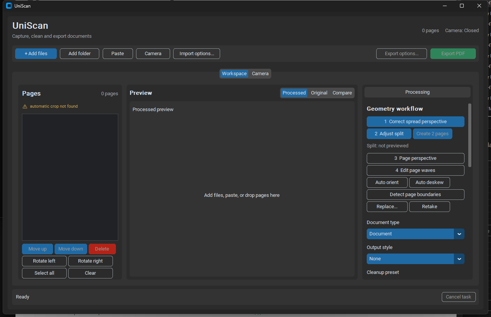
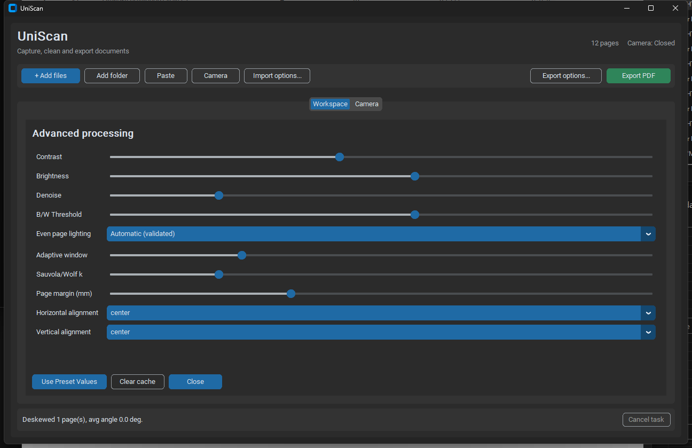
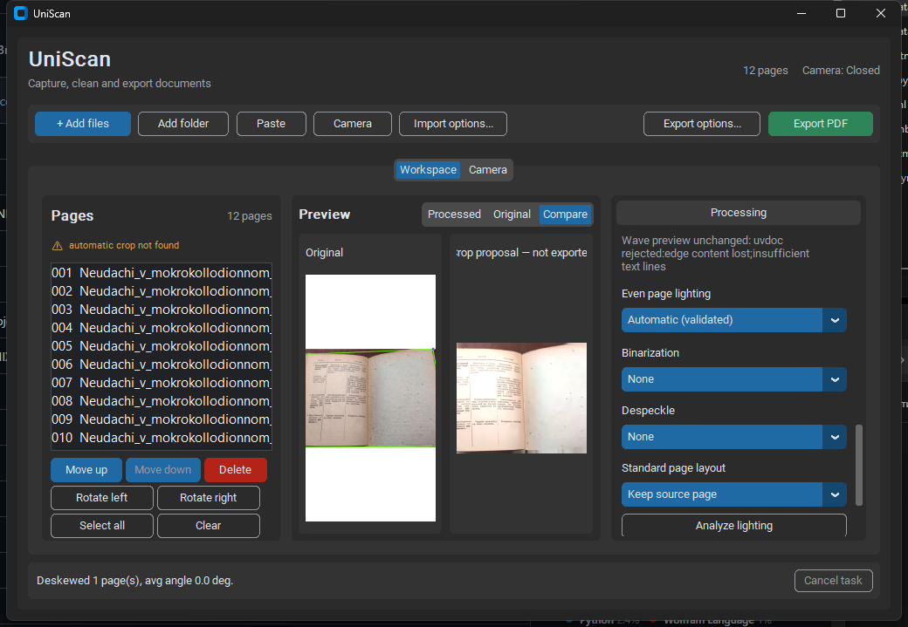

# UniScan — визуальный UX-аудит

Дата: 2026-08-21  
Проверенный HEAD: `f6ab111` (`codex/geometry-benchmark-fixes`, `origin/geometry-uvdoc`)  
Область: фактический desktop GUI на CustomTkinter, 1280×800 и минимальный размер 1024×680. Исходный код не изменялся.

## Как читать отчёт

- **Факт** — наблюдение в запущенном GUI, скриншоте или коде.
- **Гипотеза** — дизайнерское объяснение или предлагаемое решение; требует прототипа/теста.
- Критичность: **P0** — риск потери/неверного результата; **P1** — серьёзно мешает основной задаче; **P2** — заметно ухудшает понятность/доступность; **P3** — локальная полировка.

## Краткий вывод

Текущий интерфейс функционален и уже имеет неплохую основу: спокойная тёмная оболочка, отчётливые области Pages / Preview / Processing, зелёное primary-действие Export и специализированные inline-редакторы. Основная визуальная проблема не в эстетике, а в отсутствии единой визуальной грамматики pipeline: `Auto`, `Off`, `not needed`, `applied`, `rejected` и `edited` не выглядят как состояния одной системы. Поэтому одинаковая синяя заливка одновременно означает выбранный option, primary action и активную вкладку, а важные причины решений модели превращаются в мелкий технический текст.

Самый выгодный путь — сохранить спокойную оболочку, добавить семантические stage cards/chips, нормализовать canvas и фокус, а затем вынести цвета/типографику/состояния в компактные токены.

## Доказательства

### Пустое и загруженное состояния




### Сравнение и геометрические редакторы


### Плотность и расширенные настройки






## Находки по критичности

### V-01 · P1 · Нет визуальной системы состояний этапа

**Факт.** В Processing используются option menus и кнопки, но нет повторяемого stage-компонента с mode, status и reason. `Automatic (validated)` выглядит как обычное выбранное значение; `Wave preview unchanged: uvdoc rejected...` выводится отдельным серым текстом. В коде это разные `StringVar`, размещённые последовательно в прокручиваемой панели: [app.py:1393](../src/uniscan/ui/app.py#L1393), [app.py:1402](../src/uniscan/ui/app.py#L1402), [app.py:1411](../src/uniscan/ui/app.py#L1411). Строки `applied/off/unchanged` формируются только для wave preview: [app.py:4028](../src/uniscan/ui/app.py#L4028).

**Риск.** Пользователь не может быстро отличить режим от результата: «Auto выбран» не означает «модель запускалась», а «validated» не означает, что коррекция применена к экспортируемой странице.

**Гипотеза.** Один stage card должен всегда показывать три независимых слоя: `Auto / Off`, статус (`Not needed / Applied / Rejected / Edited`) и краткую причину с раскрываемыми метриками.

### V-02 · P1 · Предупреждение о crop визуально недостоверно

**Факт.** `⚠ automatic crop not found` безусловно создаётся и всегда отображается, включая пустую сессию: [app.py:1056](../src/uniscan/ui/app.py#L1056). После импорта одновременно видны это предупреждение, 12 страниц и статус `detected boundaries for all 12 page(s)`.

**Риск.** Постоянное предупреждение обесценивает warning-color и создаёт прямое противоречие с результатом импорта.

**Гипотеза.** Сводка Pages должна агрегировать реальные состояния выбранных/всех страниц: например, `2 need review`, `10 ready`; при нуле страниц предупреждение скрывается.

### V-03 · P1 · В узкой панели теряются иерархия и причины решений

**Факт.** Правая колонка имеет минимум 280 px, а сам scroll frame — 270 px: [app.py:1033](../src/uniscan/ui/app.py#L1033), [app.py:1217](../src/uniscan/ui/app.py#L1217). В ней подряд размещены geometry workflow, document/output presets, orientation, deskew, waves, lighting, binarization, despeckle, layout и действия Apply. Причины и пути переносятся в `wraplength=230`: [app.py:1353](../src/uniscan/ui/app.py#L1353), [app.py:1402](../src/uniscan/ui/app.py#L1402).

**Риск.** Важная информация выглядит вторичным debug-текстом; sticky primary action отсутствует, а модель pipeline читается только через длинную прокрутку.

**Гипотеза.** В rail оставить выбранный stage inspector, а весь порядок показать горизонтальной строкой этапов над canvas. Apply/Export readiness сделать sticky.

### V-04 · P2 · Canvas не помогает оценивать страницу

**Факт.** Original показывает крупные белые поля, processed — изображение другого визуального масштаба. В Compare панели не выровнены по общей геометрии. Геометрические редакторы используют жёсткий чёрный фон: [app.py:4503](../src/uniscan/ui/app.py#L4503), [app.py:5187](../src/uniscan/ui/app.py#L5187). Контуры и точки рисуются насыщенными зелёным/красным, а wave curves — cyan/blue/magenta: [app.py:5217](../src/uniscan/ui/app.py#L5217), [app.py:5656](../src/uniscan/ui/app.py#L5656).

**Риск.** Белые поля воспринимаются как часть страницы, а цветные линии без легенды и адаптивной обводки трудно читать на разноцветном документе. Compare не даёт надёжно сопоставлять сохранность краёв и прямолинейность таблиц.

**Гипотеза.** Нужен нейтральный canvas (`document canvas`), явная тень/граница листа, одинаковый fit/zoom, linked pan и двухслойные контуры (светлая+тёмная обводка). Для контроля качества — опциональная сетка и edge/table overlay.

### V-05 · P2 · Минимальный размер технически работает, но проверка качества становится слишком мелкой

**Факт.** Окно допускает 1024×680; три колонки остаются на экране, однако Compare превращает обе страницы в небольшие изображения, page names обрезаны, а Processing по-прежнему требует прокрутки. См. `workspace-minimum-1024x680.png` и размеры колонок: [app.py:1033](../src/uniscan/ui/app.py#L1033).

**Риск.** Пользователь видит все зоны, но не может уверенно проверить текст, края и линии таблиц — то есть nominal responsiveness не равна task usability.

**Гипотеза.** При ширине <1180 px переключать Pages в collapsible strip, а inspector — в drawer; canvas должен сохранять не менее 55–60% ширины.

### V-06 · P2 · Контраст не систематизирован между темами и состояниями

**Факт.** Текущая тёмная тема в целом читаема: `#a0a4ab` на `#2b2b2b` ≈ 5.66:1, warning ≈ 6.45:1, white on export green ≈ 4.54:1. Но light-пары `#60646c` on `#dbdbdb` ≈ 4.29:1 и `#8a5a00` on `#dbdbdb` ≈ 4.28:1 не достигают 4.5:1 для обычного текста. Camera-state цвета на тёмном фоне дают примерно 2.54–4.35:1; сами цвета заданы в [camera_health.py:24](../src/uniscan/ui/camera_health.py#L24).

**Риск.** Смысл статуса камеры передаётся цветом текста с недостаточным контрастом; light theme вероятно слабее фактически проверенной dark theme.

**Гипотеза.** Статусы должны использовать icon + label + контрастный текст, а цвет — для border/tint, не как единственный носитель значения.

### V-07 · P2 · Light/dark поддержка частичная

**Факт.** Для header и secondary text заданы парные light/dark цвета: [app.py:722](../src/uniscan/ui/app.py#L722), [app.py:731](../src/uniscan/ui/app.py#L731). При этом page list остаётся фиксированно тёмным (`#202225`), canvas — чёрным, destructive/primary/state colors — одиночными значениями: [app.py:1063](../src/uniscan/ui/app.py#L1063), [app.py:1104](../src/uniscan/ui/app.py#L1104). Явного theme switch в приложении нет.

**Вывод-инференс.** Интерфейс наследует system appearance CustomTkinter, но полноценной согласованной light theme в коде не видно.

**Гипотеза.** Ввести theme adapter и визуальные regression screenshots для обеих тем до того, как предлагать theme switch пользователю.

### V-08 · P2 · Focus/hover/disabled не образуют общего языка

**Факт.** Явные hover colors заданы главным образом Export и Delete: [app.py:792](../src/uniscan/ui/app.py#L792), [app.py:1104](../src/uniscan/ui/app.py#L1104). Listbox имеет focus border, но для большинства CustomTkinter controls отдельная focus-система не задана. Canvas editors привязаны к mouse events: [app.py:4864](../src/uniscan/ui/app.py#L4864), [app.py:6120](../src/uniscan/ui/app.py#L6120). Disabled `Create 2 pages` выглядит как бледный вариант синей кнопки без объяснения причины.

**Риск.** Клавиатурный фокус неочевиден, а disabled action требует догадки о prerequisite.

**Гипотеза.** Общий focus ring 2 px, состояния default/hover/pressed/focus/disabled/loading/error и inline-подсказка prerequisite рядом с disabled action.

### V-09 · P2 · Advanced sliders не показывают значения

**Факт.** Contrast, Brightness, Denoise, Threshold, Adaptive window, k и Margin реализованы как sliders без numeric label/input: [app.py:6309](../src/uniscan/ui/app.py#L6309). На одном уровне с ними находятся `Use Preset Values`, `Clear cache`, `Close`: [app.py:6419](../src/uniscan/ui/app.py#L6419).

**Риск.** Нельзя точно воспроизвести настройку или понять величину изменения; Clear cache выглядит как часть редактирования изображения.

**Гипотеза.** Каждому slider — текущее значение, stepper/entry, Reset и допустимый диапазон; Clear cache перенести в Settings/Diagnostics.

### V-10 · P3 · Типографика рабочая, но не токенизирована

**Факт.** Brand — 24 bold, section headers — 15–18 bold, page list — Segoe UI 11, остальное в основном CustomTkinter default: [app.py:726](../src/uniscan/ui/app.py#L726), [app.py:1046](../src/uniscan/ui/app.py#L1046), [app.py:1078](../src/uniscan/ui/app.py#L1078). Причины решений и page metadata визуально почти равны вспомогательным подписям.

**Гипотеза.** Достаточно пяти ролей: display 24/30, heading 18/24, section 15/20 semibold, body 13/18, caption 12/16; code/metrics — 12/16 tabular.

## Компактная система дизайн-токенов

Токены ниже — **предложение**, не реализованный факт. Цвет статуса всегда дублируется иконкой и текстом.

| Token | Light | Dark | Назначение |
|---|---:|---:|---|
| `surface.canvas` | `#F3F5F7` | `#181A1D` | фон приложения/inspection canvas |
| `surface.panel` | `#FFFFFF` | `#22262B` | панели |
| `surface.raised` | `#F8FAFC` | `#2A2F35` | stage cards, dialogs |
| `border.default` | `#CBD5E1` | `#434B55` | границы |
| `text.primary` | `#0F172A` | `#F8FAFC` | основной текст |
| `text.secondary` | `#475569` | `#D6DCE4` | вторичный текст |
| `text.muted` | `#64748B` | `#A7B0BC` | captions; только достаточный размер/контраст |
| `action.primary` | `#1D5F94` | `#4EA3E3` | selection, primary action |
| `focus.ring` | `#0B6BCB` | `#7CC4FF` | 2 px focus ring + 2 px offset |
| `danger` | `#B42318` | `#FF7B72` | destructive/error |
| `warning` | `#8A4B00` | `#F2B84B` | stale/needs review |
| `success` | `#157347` | `#59D98E` | applied/ready |
| `edited` | `#6D28D9` | `#C4A7FF` | manual edit |

### Семантика stage status

| Status | Цвет/иконка | UI-текст | Правило |
|---|---|---|---|
| `Auto` | blue · wand | Auto | mode, не результат |
| `Off` | slate · power-off | Off | mode и явный no-op |
| `Not needed` | neutral · minus-circle | Not needed | анализ выполнен, модель не запускалась/коррекция не нужна |
| `Applied` | green · check-circle | Applied | кандидат принят в preview/recipe; отдельно показывать committed/export-ready |
| `Rejected` | red · shield-x | Rejected | кандидат оценён и отклонён; источник сохранён |
| `Edited` | purple · pen-line | Edited | пользователь изменил параметры |
| `Stale` | amber · refresh-cw | Recompute required | upstream revision изменилась |
| `Running` | blue · spinner | Checking… | операция выполняется/можно отменить |

## Визуальные направления — без генерации вариантов

Варианты в Superdesign намеренно не генерировались; ниже только направления для выбора.

### A. Calm Technical Dark — рекомендуемое эволюционное

Сохранить существующую тёмную оболочку, но уменьшить количество сплошной синей заливки, перейти к нейтральным cards и цветным status chips. Документ остаётся самым светлым объектом, chrome — спокойным. Минимальный риск внедрения и хорошая преемственность.

### B. Paper-first Light Studio

Светлая рабочая среда с нейтрально-серым canvas и белой «бумагой», тёмными панелями только в inspection overlay. Подходит офисному/потоковому сценарию и лучше согласуется с печатным результатом. Требует полноценной light-theme QA; текущие фиксированные dark colors нельзя просто инвертировать.

### C. High-contrast Inspection

Тёмный inspection workspace с крупным canvas, связанным zoom/pan, edge/table overlays и усиленными control handles. Панели компактнее, stage states контрастнее. Лучший вариант для архивов, книг и таблиц; разумно реализовать как режим просмотра внутри направления A, а не отдельную оболочку приложения.

## Быстрые улучшения

1. Скрыть crop warning при нуле страниц и привязать его к реальному aggregate state.
2. Добавить повторяемый status chip к Perspective / Waves / Lighting / Cleanup / Layout.
3. Сделать Apply sticky; перенести длинную причину под выбранный stage с `Details`.
4. Добавить numeric values и Reset к Advanced sliders; убрать Clear cache из редактирования.
5. Нормализовать canvas: нейтральный фон, граница листа, linked fit/zoom и двухслойные overlays.
6. Ввести единый focus ring и текстовую причину disabled actions.
7. Заменить текстовый Pages list на thumbnails с status dots, сохранив multi-select.

## Структурные изменения

1. Вынести theme/status tokens из монолитного [app.py](../src/uniscan/ui/app.py) в один UI-theme слой.
2. Создать reusable `StageCard`, `StatusChip`, `DocumentCanvas`, `JobProgress`, `PageThumbnail`.
3. Разделить выбранный stage inspector и общий pipeline navigator; не держать весь pipeline в одном scroll rail.
4. Добавить screenshot regression suite для dark/light, 1280×800 и 1024×680, а также keyboard-focus snapshots.

## Критерии визуальной готовности

- Любой stage различим по mode/status/reason без чтения status bar.
- Все обычные тексты проходят WCAG AA 4.5:1, крупные — 3:1; focus и control boundaries — не менее 3:1.
- Значение не кодируется только цветом.
- В Compare исходник/результат имеют одинаковый fit, linked zoom/pan и различимую границу листа.
- На 1024×680 canvas остаётся пригодным для проверки текста и краёв; панели переходят в collapsible режим.
- Light/dark отличаются токенами, а не набором исключений.

## Follow-up 2026-08-22 — что уже реализовано и что ещё требует проверки

Этот блок дополняет исходный аудит и не заменяет его. Реализация ниже подтверждена
кодом и targeted/UI smoke tests; это не результат пользовательского тестирования.

**Реализованные факты.** `ff4742c` объединил фоновые операции в cancellable job
manager с progress/cancel/retry; `27a130b` вынес semantic color/status tokens в
[theme.py](../src/uniscan/ui/theme.py#L23) и связал их с pipeline cards;
`c54f348` добавил локальные hover/disabled/focus состояния компонентов;
`bd3f4bf` добавил linked zoom/pan, Fit/100% и synchronized Compare viewport;
`e40c04d` добавил Space hold-to-original с блокировкой в текстовых полях;
`0aca661` добавил числовые значения Advanced controls и явные reset/restore
действия; `f140905` добавил status filters страниц. Поведение проверено в
[test_ui_theme.py](../tests/test_ui_theme.py),
[test_ui_preview_viewport.py](../tests/test_ui_preview_viewport.py),
[test_ui_job_manager.py](../tests/test_ui_job_manager.py) и
[test_ui_page_filters.py](../tests/test_ui_page_filters.py).

**Оставшиеся гипотезы.** WCAG-проверка обеих тем на реальном мониторе, 200% scaling,
минимальное окно, deuteranopia/protanopia, длительные реальные batch jobs,
сохранность текста/краёв/таблиц и понятность терминов у пользователей пока не
доказаны. Не доказана и пригодность всей визуальной иерархии для 12/100 страниц.
Предложенные направления A/B/C остаются дизайнерскими гипотезами до
пользовательского теста.

**Повторяемый visual check.** На Windows с видимым рабочим столом запустить из
корня репозитория:

```powershell
python scripts/capture_ui_regression.py --output-dir .\artifacts\ui-regression
```

Скрипт запускает фактический GUI, временно задаёт отдельный
`UNISCAN_STATE_DIR`, создаёт `manifest.json` с HEAD и захватывает Light/Dark ×
1280×800/1024×680 для workspace, Advanced и keyboard-focus. Это opt-in manual
review; golden-pixel thresholds в CI нет. При ручном сравнении проверять clipping
и scroll, контраст status colors/текста, видимость focus ring, 200%/min-window
переполнение и согласованность mode/status/reason между pipeline, preview и
Advanced.

**Наблюдаемый residual (P2, quick-fix).** В принятой capture matrix при
`1024×680` summary export-readiness в верхней toolbar визуально обрезается/усекается
из-за плотности верхней панели. Это обнаруженный responsive-layout факт, а не
гипотеза; production-код в рамках tooling/docs этапа не изменялся. Evidence path:
`light-1024x680-workspace.png` и `dark-1024x680-workspace.png` из одного
accepted manifest. Рекомендуемое исправление — отдельная P2-задача
для responsive toolbar/readiness placement, с повторной ручной проверкой обоих
themes и 1024×680.
